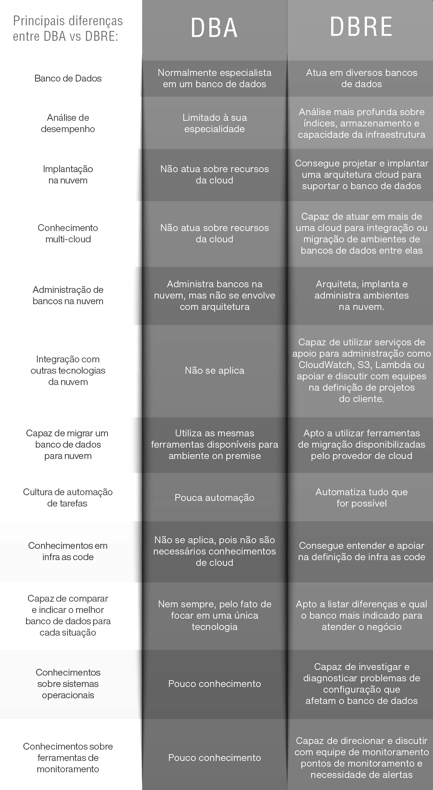

DBRE
------------------

Vimos anteriormente que o DBRE nasceu a partir da disciplina `SRE` de `DevOps`, sendo assim, espera-se que os [pilares](/01%20-%20Concept/01%20-%20Background.md#pilares-do-sre) do `SRE` também sirvam de base para esta abordagem, então do que trataremos quando o assunto for engenharia de confiabilidade de dados?

Em primcípio o profissional de `DBRE` deverá ter familiaridade com alguns assuntos da base de formação de em engenheiro de dados, como por exemplo:

*  Armazenamento de Dados
*  Tipos de Dados
*  Volumes de Dados
*  Tratamento de Dados
*  Qualificação de um Dado
*  Disponibilidade dos Dados
*  Segurança/Privacidade de um Dado
*  Gerenciamento da Informação
*  Sistemas de Gerenciamento de Dados
*  Sistemas baseados em Dados Relacionais e Não-Relacionais
  
Com estes e mais alguns conhecimentos o profissional de `DBRE` se especializa em garantir a confiabilidade, escalabilidade e desempenho dos sistemas de gerenciamento de banco de dados (DBMS) em uma organização.

Trata-se de uma evolução na carreira de `DBA`, pois há algum tempo, os administradores de bancos de dados tradicionais costumavam atuar olhando para dentro do banco de dados. Assim, um `DBA` se tornava um especialista em um banco de dados e atuava somente sobre essa tecnologia, realizando tarefas rotineiras manualmente e sem muita automatização.

Porém, no cenário atual, essa atuação tão especializada não é mais possível. As empresas estão utilizando diversos bancos de dados simultaneamente, em ambiente híbrido (on premise e nuvem), integrado com outras tecnologias de replicação e compartilhamento de dados. Os ambientes estão muito mais complexos; por isso, foi necessário que os profissionais que administram bancos de dados se modernizassem tendo um papel fundamental na sustentabilidade do negócio, além da tecnologia.

Veja um paralelo:

_fonte_: _https://ilegra.com/blog/dbre-a-evolucao-do-dba/_

Concluimos que as técnicas de `DBRE` são parte de uma estratégia corporativa que se inicia na implementação da metodologia `DevOps`, apoiado na disciplina de`SRE` e seus [pilares](/01%20-%20Concept/01%20-%20Background.md#pilares-do-sre) que permitirão aos engenheiros de `DBRE` construirem de um conjunto de implementações que trarão segurança ao negócio diante do desafio de armazenar, disponibilizar e gerenciar bem suas informações além do acesso a cada uma delas.