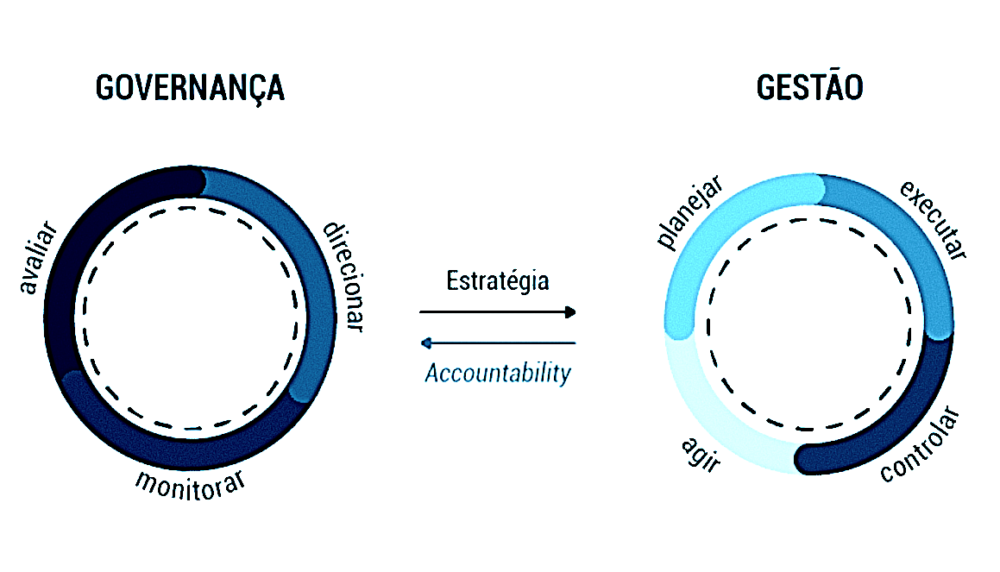

Gestão e Governança de Dados 
----------------------------

Vamos abordar com maior profundidade estes 2 conceitos fortemente ligados, mas que apresentam diferenças cruciais na administração de um dos recursos mais valiosos das corporações modernas: os Dados!

Frequentemente a `Gestão` dos dados aparece em um mesmo contexto da `Governança` sobre eles, porém é importante que o profissional `DBRE` saiba distinguir as diferenças e direcionar as discuções para o forum correto.

Resumidamente a `Governança` compreende o conjunto de mecanismos de liderança, estratégia e controle postos em prática para avaliar, direcionar e monitorar a `Gestão`, de modo complementar, a `Gestão` diz respeito ao funcionamento do dia a dia de programas e de organizações no contexto de estratégias, políticas, processos e procedimentos que tenham sido estabelecidos pela organização.

Enquanto a Gestão é inerente e integrada aos processos organizacionais, sendo responsável pelo planejamento, execução, controle, ação, enfim, pelo manejo dos recursos e poderes colocados à disposição de órgãos e entidades para a consecução de seus objetivos, a governança provê direcionamento, monitora, supervisiona e avalia a atuação da gestão, com vistas ao atendimento das necessidades e expectativas das partes interessadas.

Segundo o [`DAMA-DMBOK©`](https://www.dama.org/cpages/body-of-knowledge) as definições para estas abordagens são:

“`Gestão de Dados` é a função na organização que cuida do planejamento, controle e entrega de ativos de dados e de informação. Esta função inclui: as disciplinas do desenvolvimento, execução e supervisão de planos, políticas, programas, projetos, processos, práticas, e procedimentos que controlam, protegem, distribuem e aperfeiçoam o valor dos ativos de dados e informações”. E a `Governança de Dados` consiste no exercício de autoridade e controle (planejamento, monitoramento e execução) sobre o gerenciamento de ativos de dados.

_fonte: https://www.escolavirtual.gov.br/_