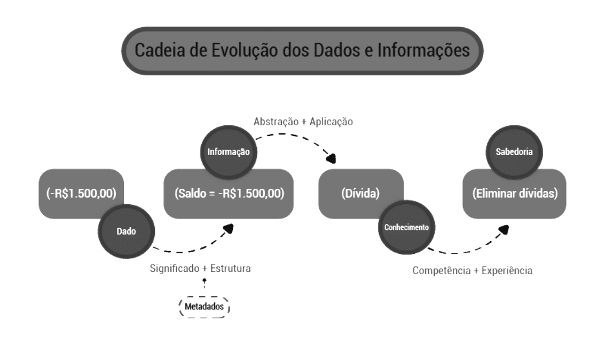

Gestão de Dados
----------------

Quando tratamos de `Gestão dos Dados` nos referimos as técnicas que implementaremos para termos as informações organizadas e seguras sob o ponto de vista técnico.

Há que salianter-se de que os `Dados` possuem uma hierarquia de qualificação que podemos definir como uma `cadeia de evolução` que explicaremos a seguir.

`Dado`, `informação`, `conhecimento` e `sabedoria` constituem a cadeia de evolução de dados e informações. Quando falamos sobre Dados, na verdade estamos nos referindo à base da matéria-prima necessária para conseguir o que todas as organizações desejam: utilizar o conhecimento das informações para tomar decisões ágeis e corretas.

A cadeia de evolução de dados e informações representa a transformação gradual e progressiva sobre o uso de dados e informações. Também serve como modelo para descobrir em que nível dessa cadeia as informações de mais alto valor estratégico são utilizadas, possibilitando, desta forma, estabelecer ações para melhorar o nível da maturidade de dados e informações.

#### Dados

São a base de todo o processo de geração da sabedoria organizacional e o primeiro estágio a ser atingido. Eles representam fatos através de um conjunto de caracteres primitivos e isolados, geralmente representados através de textos, números, imagens, sons ou vídeos. Os dados não possuem qualquer significado relevante dentro de um contexto de negócio (dados sem contexto).

#### Metadados

Representam os significados dos dados. Esses significados correspondem tanto ao conteúdo técnico do dado, obtido através das informações sobre estrutura, formato, tamanho e restrições (metadados técnicos), como informações sobre definições, conceito, relevância e regras de negócio dos dados envolvidos (metadados de negócio).

#### Informações

Correspondem aos dados processados com algum significado e são geradas e obtidas nos sistemas de processamento de transações e sistemas de apoio à decisão, reduzindo a incerteza sobre alguma coisa, estado ou evento. Quando os metadados são utilizados para leitura e interpretação dos dados, a cadeia de evolução do dado já mudou de estágio, ou seja, já está no nível da informação.

#### Conhecimento

Corresponde ao processamento das informações com significados, premissas, padrões de comportamento, tendências e valores agregados através de conjunto de regras de manipulação e características dessas informações. São o subsídio para soluções de problemas e tomadas de decisão. Atualmente, é impossível imaginar a evolução para esse estágio da cadeia sem os sistemas de apoio à decisão e as aplicações de inteligência analítica.

#### Sabedoria

É a utilização do conhecimento com efetividade. Apesar das aplicações de inteligência analítica já serem uma realidade dentro do mercado, fornecendo condições para a organização atingir o estágio anterior, muitas organizações que possuem estes subsídios desejam a sabedoria, mas não a conseguem. Parte deste fracasso está na confiabilidade dos dados, que não foram bem geridos no decorrer da evolução da cadeia. Outra parte na falta de habilidade dos profissionais em extrair as informações e utilizá-las de forma vantajosa.

````
Algumas referências sobre Gestão de Dados, incluindo o guia DAMA-DMBOK©, não descrevem e também não reconhecem 
a sabedoria como último estágio desta cadeia, justamente pelo fato dela depender em grande parte da competência
 humana para atingir este estágio.
````

#### Exemplo:




#### Funções da Gestão:

* implementar programas;
* garantir a conformidade com as regulamentações;
* revisar e reportar o progresso de ações;
* garantir a eficiência administrativa;
* manter a comunicação com as partes interessadas;
* avaliar o desempenho e aprender.

_fonte: https://cdn.evg.gov.br/_