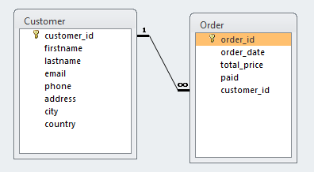

Arquitetura de Dados Relacionais
==================================

Um banco de dados relacional é um tipo de banco de dados que armazena e fornece acesso a pontos de dados relacionados entre si. Os bancos de dados relacionais  baseiam-se no modelo relacional, uma forma intuitiva e direta de representar dados em tabelas. Em um banco de dados relacional, cada linha da tabela é um registro com um ID exclusivo chamado de chave. As colunas da tabela contêm atributos dos dados, e cada registro geralmente tem um valor para cada atributo, o que facilita o estabelecimento de relações entre os pontos de dados.

Um exemplo de banco de dados relacional
-----------------------------

Aqui está um exemplo simples de duas tabelas que uma pequena empresa pode usar para processar pedidos de seus produtos. A primeira tabela é uma tabela de informações do cliente, de modo que cada registro inclui o nome do cliente, endereço, informações de envio e cobrança, número de telefone e outras informações de contato. Cada bit de informação (cada atributo) está em sua própria coluna e o banco de dados atribui um ID exclusivo (uma chave) a cada linha. Na segunda tabela - uma tabela de pedidos de clientes - cada registro inclui o ID do cliente que fez o pedido (mas não o nome do cliente ou as informações de contato), o(s) produto(s) pedido(s), a quantidade, o tamanho e a cor selecionados, estarão em outra tabela que se relaciona com o pedido pelo ID e assim constroe-se uma malha de relacionamentos dos dados.

Essas duas tabelas têm apenas uma coisa em comum: a coluna ID (a chave). Mas, devido a essa coluna comum, o banco de dados relacional pode criar um relacionamento entre as duas tabelas. Então, quando o aplicativo de processamento de pedidos da empresa envia um pedido para o banco de dados, o banco de dados pode ir para a tabela de pedidos do cliente, extrair as informações corretas sobre o pedido do produto e usar o ID do cliente dessa tabela para procurar as informações de faturamento e envio do cliente na tabela de informações do cliente. O depósito pode, então, extrair o produto correto, o cliente pode receber a entrega do pedido em tempo hábil e a empresa pode receber o pagamento.

Como os bancos de dados relacionais são estruturados
---------------------------------------

O modelo relacional significa que as estruturas de dados lógicos - tabelas de dados, exibições e índices - são separadas das estruturas de armazenamento físico. Essa separação significa que os administradores de banco de dados podem gerenciar o armazenamento físico de dados sem afetar o acesso a esses dados como uma estrutura lógica. Por exemplo, renomear um arquivo de banco de dados não renomeia as tabelas armazenadas nele.

A distinção entre lógico e físico também se aplica às operações do banco de dados, que são ações claramente definidas que permitem que os aplicativos [manipulem os dados](https://www.oracle.com/database/what-is-data-management/) e as estruturas do banco de dados. As operações lógicas permitem que um aplicativo especifique o conteúdo de que precisa, e as operações físicas determinam como esses dados devem ser acessados e, em seguida, executam a tarefa.

Para garantir que os dados sejam sempre precisos e acessíveis, os bancos de dados relacionais seguem determinadas regras de integridade. Por exemplo, uma regra de integridade pode especificar que não são permitidas linhas duplicadas em uma tabela, a fim de eliminar a possibilidade de informações errôneas entrarem no banco de dados.

O modelo relacional
--------------------

Nos primeiros anos dos bancos de dados, cada aplicativo armazenava dados em sua própria estrutura exclusiva. Quando os desenvolvedores queriam criar aplicativos para usar esses dados, precisavam saber muito sobre a estrutura de dados específica para encontrar os dados de que precisavam. Essas estruturas de dados eram ineficientes, difíceis de manter e difíceis de otimizar para proporcionar um bom desempenho dos aplicativos. O modelo de banco de dados relacional foi projetado para resolver o problema de várias estruturas de dados arbitrárias.

O modelo de dados relacional forneceu uma maneira padrão de representar e consultar dados que poderiam ser usados por qualquer aplicativo. Desde o início, os desenvolvedores reconheceram que o principal ponto forte do modelo de banco de dados relacional era o uso de tabelas, que eram uma forma intuitiva, eficiente e flexível de armazenar e acessar informações estruturadas.

Com o tempo, outro ponto forte do modelo relacional surgiu quando os desenvolvedores começaram a usar a linguagem de consulta estruturada (SQL) para escrever e consultar dados em um banco de dados. Durante muitos anos, a SQL foi amplamente usada como linguagem para consultas a bancos de dados. Com base na álgebra relacional, o SQL oferece uma linguagem matemática internamente consistente que facilita o aprimoramento do desempenho de todas as consultas a bancos de dados. Em comparação, outras abordagens precisam definir consultas individuais.

Benefícios do sistema de gerenciamento de banco de dados relacional
-------------------------------------------------

O modelo relacional simples, porém poderoso, é usado por organizações de todos os tipos e tamanhos para uma ampla variedade de necessidades de informações. Os bancos de dados relacionais são usados para rastrear estoques, processar transações de comércio eletrônico, gerenciar grandes quantidades de informações essenciais sobre clientes e muito mais. Um banco de dados relacional pode ser considerado para qualquer necessidade de informação na qual os pontos de dados se relacionam entre si e devem ser gerenciados de forma segura, consistente e baseada em regras, entre os benefícios destacamos:

* Amplamente conhecido e utilizado.
* Variedade de ferramentas para implantação e gerenciamento
* Implementa técnicas de segurança
* Alta aplicabilidade para diversos tipos de negócio
* Maturidade de implementação/boas práticas.

Os bancos de dados relacionais existem desde a década de 1970. Atualmente, as vantagens do modelo relacional continuam a torná-lo o modelo mais amplamente aceito para bancos de dados.

Modelo relacional e consistência de dados
-------------------------------------

O modelo relacional é o melhor para manter a consistência dos dados entre aplicativos e cópias do banco de dados (chamadas instâncias). Por exemplo, quando um cliente deposita dinheiro em um caixa eletrônico e depois consulta o saldo da conta em um telefone celular, ele espera ver esse depósito refletido imediatamente em um saldo atualizado da conta. Os bancos de dados relacionais são excelentes nesse tipo de consistência de dados, garantindo que várias instâncias de um banco de dados tenham os mesmos dados o tempo todo.

É difícil para outros tipos de bancos de dados manter esse nível de consistência em tempo hábil com grandes quantidades de dados. Alguns bancos de dados recentes, como o NoSQL, podem fornecer apenas "consistência eventual". De acordo com esse princípio, quando o banco de dados é dimensionado ou quando vários usuários acessam os mesmos dados ao mesmo tempo, os dados precisam de algum tempo para "recuperar o atraso". A consistência eventual é aceitável para alguns usos, como para manter as listagens em um catálogo de produtos, mas para operações comerciais críticas, como transações de carrinho de compras, o banco de dados relacional ainda é o padrão ouro.

Atomicidade
------------------------

Os bancos de dados relacionais lidam com regras e políticas comerciais em um nível muito granular, com políticas rígidas sobre comprometimento (ou seja, tornar permanente uma alteração no banco de dados). Por exemplo, considere um banco de dados de inventário que rastreia três peças que são sempre usadas juntas. Quando uma peça é retirada do estoque, as outras duas também devem ser retiradas. Se uma das três peças não estiver disponível, nenhuma das peças deve ser retirada - todas as três peças devem estar disponíveis antes de o banco de dados assumir qualquer compromisso. Um banco de dados relacional não se comprometerá com uma peça até saber que pode se comprometer com todas as três. Esse recurso de compromisso multifacetado é chamado de atomicidade. A atomicidade é a chave para manter a precisão dos dados no banco de dados e garantir que eles estejam em conformidade com as regras, os regulamentos e as políticas da empresa.

DBMS
-----------
Data Base Management System ou `Sistema de Gerenciamento de Banco de Dados` (SGBD) é um conjunto de software utilizado para o gerenciamento de uma base de dados, responsáveis por controlar, acessar, organizar e proteger as informações de uma aplicação, tendo como principal objetivo gerenciar as bases de dados utilizadas por aplicações clientes e remover esta responsabilidade das mesmas.

Muito utilizado por diversas organizações, é uma forma de concentrar toda base de dados empresarial em um único lugar, provendo a facilidade na hora da sua consulta e protegendo assim as informações, que são primordiais e essenciais para toda a organização.

Propriedades ACID e DBMS
-------------------------

Quatro propriedades essenciais definem as transações de bancos de dados relacionais: atomicidade, consistência, isolamento e durabilidade - normalmente chamadas de ACID.

* A atomicidade define todos os elementos que compõem uma transação de banco de dados completa.
* Consistência define as regras para manter os pontos de dados em um estado correto após uma transação.
* Isolamento mantém o efeito de uma transação invisível para os outros até que ela seja confirmada, para evitar erros na operação.
* A durabilidade garante que as alterações nos dados se tornem permanentes depois que a transação for confirmada.

Stored Procedures e bancos de dados relacionais
------------------------------------------

O acesso aos dados envolve muitas ações repetitivas. Por exemplo, uma simples consulta para obter informações de uma tabela de dados pode precisar ser repetida centenas ou milhares de vezes para produzir o resultado desejado. Essas funções de acesso a dados exigem algum tipo de código para acessar o banco de dados. Os desenvolvedores de aplicativos não querem escrever um novo código para essas funções em cada novo aplicativo. Felizmente, os bancos de dados relacionais permitem procedimentos armazenados, que são blocos de código que podem ser acessados com uma simples chamada de aplicativo. Por exemplo, um único procedimento armazenado pode fornecer marcação consistente de registros para usuários de vários aplicativos. Os procedimentos armazenados também podem ajudar os desenvolvedores a garantir que determinadas funções de dados no aplicativo sejam implementadas de uma maneira específica.

Bloqueio e simultaneidade de banco de dados
--------------------------------

Podem surgir conflitos em um banco de dados quando vários usuários ou aplicativos tentam alterar os mesmos dados ao mesmo tempo. As técnicas de bloqueio e simultaneidade reduzem o potencial de conflitos e, ao mesmo tempo, mantêm a integridade dos dados.

O bloqueio impede que outros usuários e aplicativos acessem os dados enquanto eles estão sendo atualizados. Em alguns bancos de dados, o bloqueio se aplica a toda a tabela, o que gera um impacto negativo no desempenho do aplicativo. Outros bancos de dados, como os bancos de dados relacionais Oracle, aplicam bloqueios no nível do registro, deixando disponíveis os outros registros da tabela, o que ajuda a garantir um melhor desempenho do aplicativo.

A simultaneidade gerencia a atividade quando vários usuários ou aplicativos invocam consultas ao mesmo tempo no mesmo banco de dados. Esse recurso fornece o acesso correto a usuários e aplicativos de acordo com as políticas definidas para o controle de dados.

O que procurar ao selecionar um banco de dados relacional
-----------------------------------------------------

O software usado para armazenar, gerenciar, consultar e recuperar dados armazenados em um banco de dados relacional é chamado de sistema de gerenciamento de banco de dados relacional (RDBMS). O RDBMS fornece uma interface entre os usuários, os aplicativos e o banco de dados, além de funções administrativas para gerenciar o armazenamento, o acesso e o desempenho dos dados.

Vários fatores podem orientar sua decisão ao escolher entre tipos de bancos de dados e produtos de bancos de dados relacionais. O RDBMS escolhido dependerá de suas necessidades comerciais. Faça a si mesmo as seguintes perguntas:

* Quais são os nossos requisitos de precisão de dados? O armazenamento e a precisão dos dados dependerão da lógica comercial? Nossos dados têm requisitos rigorosos de precisão (por exemplo, dados financeiros e relatórios governamentais)?
* Precisamos de escalabilidade? Qual é a escala dos dados a serem gerenciados e qual é o crescimento previsto? O modelo de banco de dados precisará oferecer suporte a cópias espelhadas do banco de dados (como instâncias separadas) para fins de escalabilidade? Em caso afirmativo, ele poderá manter a consistência dos dados entre essas instâncias?
* Qual é a importância da simultaneidade? Vários usuários e aplicativos precisarão de acesso simultâneo aos dados? O software do banco de dados oferece suporte à simultaneidade e, ao mesmo tempo, protege os dados?
* Quais são as nossas necessidades de desempenho e confiabilidade? Precisamos de um produto de alto desempenho e alta confiabilidade? Quais são os requisitos de desempenho de resposta a consultas? Quais são os compromissos do fornecedor em relação aos acordos de nível de serviço (SLAs) ou ao tempo de inatividade não planejado?

O banco de dados relacionais avançados: O banco de dados autônomo
----------------------------------------------------------------

Com o passar dos anos, os bancos de dados relacionais ficaram melhores, mais rápidos, mais fortes e mais fáceis de trabalhar. Mas eles também se tornaram mais complexos, e administrar o banco de dados tem sido um trabalho de tempo integral. Em vez de usar sua experiência para se concentrar no desenvolvimento de aplicativos inovadores que agregam valor aos negócios, os desenvolvedores tiveram que dedicar a maior parte do tempo à atividade de gerenciamento necessária para otimizar o desempenho do banco de dados.

Hoje, a [tecnologia autônoma](https://www.oracle.com/autonomous-database/) está aproveitando os pontos fortes do modelo relacional, da tecnologia [banco de dados em nuvem](https://www.oracle.com/database/what-is-a-cloud-database/) e do [aprendizado de máquina](https://www.oracle.com/artificial-intelligence/machine-learning/what-is-machine-learning/?source=:so:tw:or:awr:ocl::cloud) para oferecer um novo tipo de banco de dados relacional. O banco de dados autônomo (também conhecido como *autonomous database*) mantém o poder e as vantagens do modelo relacional, mas usa inteligência artificial (IA), aprendizado de máquina e automação para monitorar e melhorar o desempenho da consulta e as tarefas de gerenciamento. Por exemplo, para melhorar o desempenho da consulta, o banco de dados autônomo pode levantar hipóteses e testar índices para tornar as consultas mais rápidas e, em seguida, colocar os melhores em produção - tudo por conta própria. O banco de dados autônomo faz essas melhorias continuamente, sem a necessidade de envolvimento humano.

_fonte: https://www.oracle.com/_