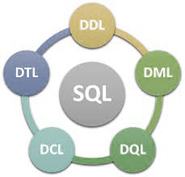
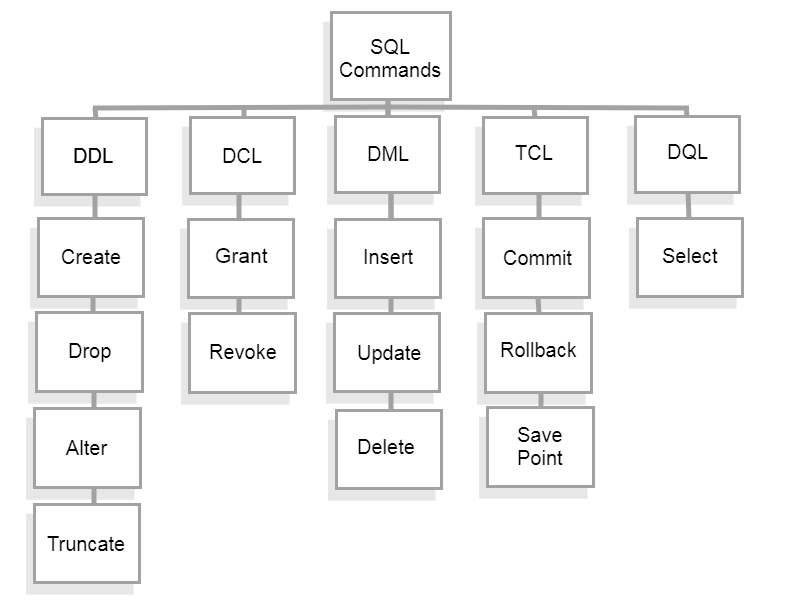

SQL - Structured Query Language
=================================

 `SQL`(Structured Query Language) é uma linguagem de programação para armazenar e processar informações em um banco de dados relacional. Um banco de dados relacional armazena informações em forma de tabela, com linhas e colunas que representam diferentes atributos de dados e as várias relações entre os valores dos dados. Você pode usar instruções SQL para armazenar, atualizar, remover, pesquisar e recuperar informações do banco de dados. Você também pode usar o SQL para manter e otimizar o desempenho do banco de dados. `SQL` é usada com frequência em todos os tipos de aplicativos. Os analistas e desenvolvedores de dados aprendem e usam o SQL porque ele se integra bem a diferentes linguagens de programação. Por exemplo, eles podem incorporar consultas SQL com a linguagem de programação Java para criar aplicativos de processamento de dados de alto desempenho com os principais sistemas de banco de dados SQL, como Oracle ou MS SQL Server. O SQL também é bastante fácil de aprender, pois usa palavras-chave comuns em inglês em suas instruções

O SQL foi inventado na década de 1970 com base no modelo de dados relacionais. Inicialmente, era conhecido como linguagem de consulta estruturada em inglês (SEQUEL). Posteriormente, o termo foi abreviado para SQL. A Oracle, anteriormente conhecida como Relational Software, tornou-se o primeiro fornecedor a oferecer um sistema de gerenciamento de banco de dados relacional SQL comercial.

SQL statements
----------------

As `SQL statements`(instruções SQL), ou `Querys`(consultas SQL), são instruções válidas que os sistemas de gerenciamento de bancos de dados relacionais entendem. Os desenvolvedores de software criam instruções SQL usando diferentes elementos da linguagem SQL. Os elementos da linguagem SQL são componentes como identificadores, variáveis e condições de pesquisa que formam uma instrução SQL correta.

A Linguagem `SQL` possue um agrupamento de comandos específicos para determinadas ações em um banco de dados, trataremo com maior detalhe sobre alguns dos grupos, porém, já podemos adiantar como estes comandos estão classificados:

* DDL - Data Definition Language - Linguagem de Definição de Dados.
São os comandos que interagem com os objetos do banco.

    São comandos DDL : CREATE, ALTER e DROP

* DML - Data Manipulation Language - Linguagem de Manipulação de Dados.
São os comandos que interagem com os dados dentro das tabelas.

    São comandos DML : INSERT, DELETE e UPDATE

* DQL - Data Query Language - Linguagem de Consulta de dados.

    São os comandos de consulta.

    São comandos DQL : SELECT (é o comando de consulta)
Aqui cabe um parenteses. Em alguns livros o SELECT fica na DML em outros tem esse grupo próprio.

* DTL - Data Transaction Language - Linguagem de Transação de Dados.
São os comandos para controle de transação.

    São comandos DTL : BEGIN TRANSACTION, COMMIT E ROLLBACK

* DCL - Data Control Language - Linguagem de Controle de Dados.
    São os comandos para controlar a parte de segurança do banco de dados.

    São comandos DCL : GRANT, REVOKE E DENY.

Como funciona o SQL?
--------------------
A implementação da linguagem de consulta estruturada (SQL) envolve um computador servidor que processa as consultas ao banco de dados e retorna os resultados. O processo SQL passa por vários componentes de software, incluindo os seguintes. 

### Parser
O `Parser`(analisador) começa tokenizando, ou substituindo, algumas das palavras na instrução SQL por símbolos especiais. Em seguida, ele verifica a instrução quanto aos seguintes aspectos:

#### Correção
O Parser`(analisador) verifica se a instrução SQL está em conformidade com a semântica SQL, ou regras, que garantem a correção da instrução de consulta. Por exemplo, o analisador verifica se o comando SQL termina com um ponto e vírgula. Se o ponto e vírgula estiver faltando, o analisador retornará um erro.

#### Autorização
O Parser`(analisador) também valida se o usuário que está executando a consulta tem a autorização necessária para manipular os respectivos dados. Por exemplo, somente usuários administradores podem ter o direito de excluir dados. 

#### Mecanismo relacional
O mecanismo relacional, ou `query processor`, cria um plano para recuperar, gravar ou atualizar os dados correspondentes da maneira mais eficaz. Por exemplo, ele verifica se há consultas semelhantes, reutiliza métodos anteriores de manipulação de dados ou cria um novo. Ele grava o plano em uma representação de nível intermediário da instrução SQL chamada código de byte. Os bancos de dados relacionais usam o código de bytes para realizar pesquisas e modificações no banco de dados com eficiência. 

#### Mecanismo de armazenamento
O mecanismo de armazenamento(storage engine), ou mecanismo de banco de dados, é o componente de software que processa o código de byte e executa a instrução SQL pretendida. Ele lê e armazena os dados nos arquivos do banco de dados no armazenamento físico em disco. Após a conclusão, o mecanismo de armazenamento retorna o resultado para o aplicativo solicitante.